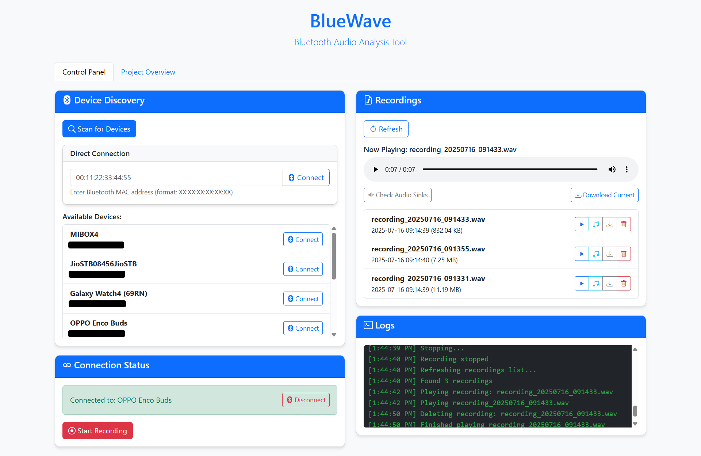

# BlueWave - Bluetooth Audio Analysis Tool



## Overview

BlueWave is an enhanced version inspired by [BlueSpy](https://github.com/TarlogicSecurity/BlueSpy), with added features such as a Web UI for more accessible control and monitoring of Bluetooth devices. This PoC tool is designed to demonstrate vulnerabilities that allow unauthorized pairing and audio recording from Bluetooth devices.

The PoC was showcased during the **BSAM: Seguridad en Bluetooth** talk at **RootedCON 2024** in Madrid. Its main goal is to raise awareness about insecure Bluetooth usage and promote the **Bluetooth Security Assessment Methodology (BSAM)**. More details can be found in the [BSAM publication](https://www.tarlogic.com/bsam/).

## Key Features

- **Web Interface**: Seamless Bluetooth management through a user-friendly web UI.
- **Device Discovery**: Scan and find nearby Bluetooth devices.
- **Pairing and Connection**: Exploits vulnerabilities in the Bluetooth pairing process.
- **Audio Recording and Playback**: Captures audio from Bluetooth devices and allows replay.

## System Requirements

- Python 3.11.8
- Linux system with the BlueZ Bluetooth stack
- PulseAudio-compatible audio server (e.g., PipeWire)

## Tools Used

- `bluetoothctl` for device interaction
- `btmgmt` for Bluetooth management
- `pactl`, `parecord`, `paplay` for audio control and playback
- `Flask` for the Web Interface

## Setup

1. Ensure that the target Bluetooth device is discoverable and connectable.
2. Verify that your system has a functioning BlueZ Bluetooth stack and a PulseAudio-compatible audio server.

## Installation

1. Clone the repository:
   ```bash
   git clone https://github.com/sidinsearch/BlueWave.git
   cd BlueWave
   ```

2. Install dependencies:
   ```bash
   pip install -r requirements.txt
   ```

3. Run the Web UI:
   ```bash
   flask run
   ```

## Execution

To discover the device address:
```bash
bluetoothctl
[bluetooth]# scan on
```

To start BlueWave:
```bash
python BlueSpy.py -a <device_address>
```

Superuser permissions may be required to modify the BlueZ configuration.

## Troubleshooting

If issues arise:
- Check the individual scripts like `pair.py`, `connect.py`, and `just_record.py`.
- Run commands manually for debugging as detailed in `core.py`.

## References and Further Reading

- [BSAM: Bluetooth Security Assessment Methodology](https://www.tarlogic.com/bsam/)
- [BlueSpy Blog Post](https://www.tarlogic.com/blog/bluespy-spying-on-bluetooth-conversations/)
- [Original BlueSpy Project](https://github.com/TarlogicSecurity/BlueSpy)

## License

This project is licensed under the MIT License - see the [LICENSE](LICENSE) file for details.
